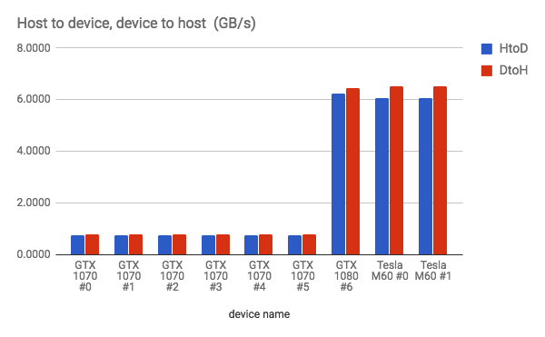
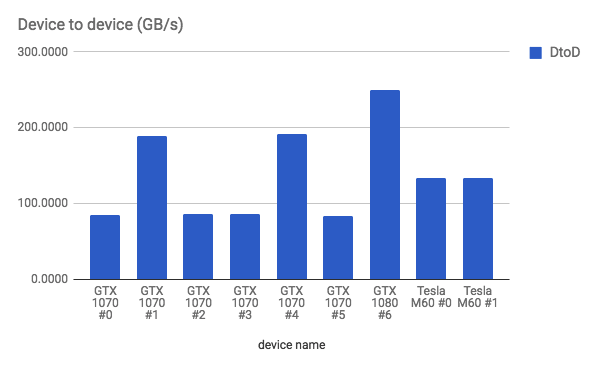

# Hardware

Important aspect for data transfers and for computation of gradients is hardware. In particular bandwidth among GPUs, between GPUs and CPU and within GPU is very important for multi-GPU training.

Let's quickly review some information about connection possibilities regarding GPUs. Then we present our testing equipment (a custom-built machine and a cloud instance), measure the various bandwidths and discuss the results.

## Resources

- [List of common GPUs for deep learning and their parameters](https://docs.google.com/spreadsheets/d/1pQNWTLfsBmclB3lojc5DHPZCRoKATjNqDA1Sbwq4zeE/edit#gid=0).
- [A Full Hardware Guide to Deep Learning](http://timdettmers.com/2015/03/09/deep-learning-hardware-guide/)

## Connections for data transfer

Connection of GPUs to CPU:

- PCIe
    - at best 16x lanes per slot
    - motherboards can have 1-8 such slots
    - ideally full 16x lanes per GPU
    - less ideally shared among multiple GPUs
    - if connected directly to the motherboard each GPU need physically two slots
    - can be connected via extender or a motherboard have 2x spacing
    - depends also on the CPU

Interconnection of GPUs (for peer-to-peer transfers - bypassing the CPU):

- PCIe
    - on commodity hardware
    - max ~ 6 GB/s on a x16 slot
- NVLink
    - on high-end hardware such as NVIDIA DGX-1
    - GPUs connected in a hyper-cube topology
    - 40 GB/s per between two GPUs
    - each of 8 GPU can be connected to 4 neighbors
    - higher performance
    - not essential to get almost linear speed-up with TensorFlow

Since we don't target at distributed training now we omit interconnection between machines (like ethernet, infiniband, etc.).

### Hierarchy of data transfer speeds

Rough numbers to have some idea (unidirectional transfer):

- within GPU: ~200-500 GB/s
- between CPU and RAM: ~10-60 GB/s
- between GPUs
    - PCIe: ~ 1-16 GB/s (1x-16x)
    - NVLink: ~ 20 GB/s
- between GPU and CPU
    - PCIe: ~ 1-16 GB/s
- SSD
    - PCIe: ~2 GB/s
    - SATA: ~500 MB/s
- HDD: ~150 MB/s

## Custom 7-GPU machine vs. cloud instances

In our experiments we used our custom-built machine and a cloud instance from Azure.

### `7gforce` - DIY machine - 6x 1070 + 1x 1080

Adapted from mining to deep learning.

- motherboard: [ASUS X99-E WS Rev 1.xx](https://www.asus.com/Commercial-Servers-Workstations/X99E_WS/specifications/) (like on NVIDIA DIGITS DevBox)
    - 7 physical PCIe slots
    - up to four 16x slots
    - configurations: x16/x8/x8/x8/x8/x8/x8, x16/x16/x16/x16, ...
- GPUs:
    - 6x GTX 1070 - 1920 cores, 8 GB RAM, max 256 GB/s memory bandwidth
        - connected via PCIe extenders
    - 1x GTX 1080 - 2560 cores, 8 GB RAM, max 320 GB/s memory bandwidth
        - connected directly to the motherboard
    - total: 14080 cores, 56 GB RAM
    - air cooling
- CPU: Intel(R) Xeon(R) CPU E5-2630 v4 @ 2.20GHz
    - 10 physical cores, 20 virtual cores
    - max supported PCIe lanes: 40
      - we'd like to use up to 64 lanes, but are using just 14 (21 %)!
    - CoolMaster water cooling
- 128 GB RAM
- chasis: open-air case like [Crypto Tsunami](http://www.ebay.com/itm/8-9-10-GPU-Zcash-ZEC-Ethereum-aluminum-open-air-mining-case-Crypto-Tsunami-/222427931353)
- PSU: 1000W + 750W

Observations:

- 6x GTX 1070 connected by PCIe extenders
    - even though the board supports 8x connections, the the extenders are just x1!
    - thus unidirectional transfer speed is just ~750 MB/s
    - unfortunately x16 extenders were allegedly unstable
- looks that GPUs 0-2 are in one PCIe switch group, 3-6 in another one
- GTX 1080
    - looks like having x8 connection (~6 GB/s)
    - it seems it's on the wrong side of the motherboard ([user manual](http://dlcdnet.asus.com/pub/ASUS/mb/Socket2011-R3/X99-E_WS/Manual/E12546_X99-E_WS_UM_V3_WEB.pdf?_ga=2.220144794.2062052960.1507119852-1126135003.1501518425) - 1.2.5 Expansion slots)
- in this state for single-GPU training it's not bad, but for multi-GPU it's a bit limited
- maybe we'll give a try to different extenders or configuration
- I though there are 2 CPU (according to /proc/cpuinfo), but there's only one
  - but if we have one CPU with only 40 lanes we cannot use full x16/x8/x8/x8/x8/x8/x8 configuration
  - only something like: 8+8+8+4+4+4+4 or 16+4+4+4+4+4+4 or 8+8+8+8+2+2+2
  - other option how to have more than 4 GPUs at full bandwidth would be to have a board with 2 CPUs, each supporting 40 lanes
  - possibly it may not matter so much until we our training code is super optimal
- temperature at around 70 deg C with full GPU utilization

```
# number of sockets/cores/threads
$ lscpu
# CPU model:
cat /proc/cpuinfo |grep 'model name'
# Number of cores:
cat /proc/cpuinfo | grep processor | wc -l
# CPU temperature
$ sensors
# summary: around 32 deg C...
```

```
$ nvidia-smi
Wed Oct  4 17:07:36 2017       
+-----------------------------------------------------------------------------+
| NVIDIA-SMI 384.69                 Driver Version: 384.69                    |
|-------------------------------+----------------------+----------------------+
| GPU  Name        Persistence-M| Bus-Id        Disp.A | Volatile Uncorr. ECC |
| Fan  Temp  Perf  Pwr:Usage/Cap|         Memory-Usage | GPU-Util  Compute M. |
|===============================+======================+======================|
|   0  GeForce GTX 1070    Off  | 00000000:05:00.0 Off |                  N/A |
| 57%   77C    P2   146W / 151W |    605MiB /  8112MiB |    100%      Default |
+-------------------------------+----------------------+----------------------+
|   1  GeForce GTX 1070    Off  | 00000000:06:00.0 Off |                  N/A |
| 57%   77C    P2   144W / 151W |    605MiB /  8114MiB |    100%      Default |
+-------------------------------+----------------------+----------------------+
|   2  GeForce GTX 1070    Off  | 00000000:07:00.0 Off |                  N/A |
| 53%   73C    P2   153W / 151W |    605MiB /  8114MiB |     98%      Default |
+-------------------------------+----------------------+----------------------+
|   3  GeForce GTX 1070    Off  | 00000000:0A:00.0 Off |                  N/A |
| 52%   72C    P2   148W / 151W |    605MiB /  8114MiB |    100%      Default |
+-------------------------------+----------------------+----------------------+
|   4  GeForce GTX 1070    Off  | 00000000:0B:00.0 Off |                  N/A |
| 56%   76C    P2   151W / 151W |    605MiB /  8114MiB |    100%      Default |
+-------------------------------+----------------------+----------------------+
|   5  GeForce GTX 1070    Off  | 00000000:0C:00.0 Off |                  N/A |
| 50%   72C    P2   150W / 151W |    605MiB /  8114MiB |    100%      Default |
+-------------------------------+----------------------+----------------------+
|   6  GeForce GTX 1080    Off  | 00000000:0D:00.0 Off |                  N/A |
| 58%   70C    P2   203W / 200W |    631MiB /  8114MiB |    100%      Default |
+-------------------------------+----------------------+----------------------+
```

### `az-2x-m60`

- [Azure Standard_NV12](https://docs.microsoft.com/en-us/azure/virtual-machines/windows/sizes-gpu)
- the physical machine has 4x M60 on two boards
  - they provide VMs with 1, 2, or 4 of them
- GPU: 2x Tesla M60
- CPU: Intel(R) Xeon(R) CPU E5-2690 v3 @ 2.60GHz, 12 cores
- 112 GB RAM
- seems to work well for multi-GPU training
- note that M60 slower than GTX 1070

```
$ nvidia-smi
Wed Oct  4 15:08:10 2017       
+-----------------------------------------------------------------------------+
| NVIDIA-SMI 375.82                 Driver Version: 375.82                    |
|-------------------------------+----------------------+----------------------+
| GPU  Name        Persistence-M| Bus-Id        Disp.A | Volatile Uncorr. ECC |
| Fan  Temp  Perf  Pwr:Usage/Cap|         Memory-Usage | GPU-Util  Compute M. |
|===============================+======================+======================|
|   0  Tesla M60           Off  | 9FA3:00:00.0     Off |                  Off |
| N/A   39C    P0    39W / 150W |      0MiB /  8123MiB |      0%      Default |
+-------------------------------+----------------------+----------------------+
|   1  Tesla M60           Off  | C533:00:00.0     Off |                  Off |
| N/A   41C    P0    39W / 150W |      0MiB /  8123MiB |      0%      Default |
+-------------------------------+----------------------+----------------------+
```

### Others

Not used in our tests.

- `az-4x-m60` - Azure Standard_NV24 (4x Tesla M60)
- HW with NVLink (such as NVIDIA DGX-1) would be much better, but we don't have access to any, thus we can't measure.

## Topology

Tip from [caffe multi-GPU](https://github.com/BVLC/caffe/blob/master/docs/multigpu.md):

```
$ nvidia-smi topo -m
```

```text
Legend:

  X   = Self
  SOC  = Connection traversing PCIe as well as the SMP link between CPU sockets(e.g. QPI)
  PHB  = Connection traversing PCIe as well as a PCIe Host Bridge (typically the CPU)
  PXB  = Connection traversing multiple PCIe switches (without traversing the PCIe Host Bridge)
  PIX  = Connection traversing a single PCIe switch
  NV#  = Connection traversing a bonded set of # NVLinks
```

`7gforce`:

- two groups (within group just PCIe switch, between via CPU)
- probably one swich (0-2) is on CPU 1, and the other (3-6) on CPU 2

```text
        GPU0    GPU1    GPU2    GPU3    GPU4    GPU5    GPU6    CPU Affinity
GPU0     X      PIX     PIX     PHB     PHB     PHB     PHB     0-19
GPU1    PIX      X      PIX     PHB     PHB     PHB     PHB     0-19
GPU2    PIX     PIX      X      PHB     PHB     PHB     PHB     0-19
GPU3    PHB     PHB     PHB      X      PIX     PIX     PIX     0-19
GPU4    PHB     PHB     PHB     PIX      X      PIX     PIX     0-19
GPU5    PHB     PHB     PHB     PIX     PIX      X      PIX     0-19
GPU6    PHB     PHB     PHB     PIX     PIX     PIX      X      0-19
```


```text
Expected topology:

          /----- CPU 0 (PHB) -----\
        /                          \
  PCIe switch (PIX)           PCIe switch (PIX)
  /    |     \             /    |    |    \
GPU 0  GPU 1  GPU 2   GPU 3  GPU 4  GPU 5  GPU 6
```

`az-2x-m60`:

- two GPUs on each board, but it seems the the GPUs communicate via QPI (interconnect between multiple CPU sockets)
  - "SOC = Connection traversing PCIe as well as the SMP link between CPU sockets(e.g. QPI)" - SOC probably from `_soc_ket`
- strange: I'd expect that two GPUs on one board would be provisioned to the VM. It seems that we've been provisioned another GPU from the second board which is connected to another CPU. It would be interesting to compare the topology for several VMs. Others may be allocated within one CPU.

```text
GPU0    GPU1    CPU Affinity
GPU0     X     SOC    0-11
GPU1    SOC     X     0-11
```

```text
Expected topology:

        *CPU 1* <--[QPI]--> CPU 2
        /                    \
  PCIe switch (PIX)       PCIe switch (PIX)
  /         \             /         \
*GPU 1*    GPU 2        *GPU 3*     GPU 4
(phys. board 1)         (phys. board 2)
  *                       *
  \----------------------/
      ^- what we might have beed provisioned
```

## Bandwidth measurements

- [code and raw results](https://github.com/rossumai/keras-multi-gpu/tree/master/experiments/gpu_bandwidth/cuda_samples) using CUDA samples
    - [`bandwidthTest`](http://docs.nvidia.com/cuda/cuda-samples/index.html#bandwidth-test)
        - pure unidirectional bandwidth on single GPU
    - [`p2pBandwidthLatencyTest`](http://docs.nvidia.com/cuda/cuda-samples/index.html#peer-to-peer-bandwidth-latency-test-with-multi-gpus)
        - combination of uni/bi-direction communication between pairs
        - combination of peer-to-peer transfer enabled/disabled
- [Sheet with measurement details](https://docs.google.com/spreadsheets/d/1c5yGydEANMzHjBufTzph0w-WGwJyiwPMRYz3yBZatb4/edit#gid=126374473)




### Observations

`7fgorce`:

- host <-> device bandwidth for the 1070 GPUs is terribly low (~750 MB/s) - because of 1x PCIe risers
- host <-> device bandwidth for the 1080 rather ok (~6.3 GB/s)
    - still it operates on a x8 slot instead of x16
    - would be interesting to measure for x16, should be still twice faster
    - a side note: another GTX 980 Ti at x16 slot makes 12.9 GB/s
- for unidirectional transfer devices 0,2,3,5 are 2.26x slower then 1,4 - why?
- for bidirectional transfer devices 0-5 have similar speed
- peer-to-peer transfers between all device pairs are allowed
- peer-to-peer speed: ~0.73-0.82 GB/s
- when P2P is enabled speed between devices within a PCIe switch group is slightly higher
- internal bandwidth is still lower than from data-sheet:
    - 1070: 195 (max. 256 GB/s, 76%)
    - 1080: 256 (max. 320 GB/s, 80%)
    - probably this test is not saturating it...

`az-2x-m60`:

- host to device: 6 GB/s (within PCIe x8)
- device to host: 6.5 GB/s (within PCIe x8)
- device to device (within a GPU): 133.2 GB/s (max. 160 GB/s, 83%)
- peer-to-peer transfer between device pairs are not allowed!
    - anyway the transfer speed is high (5.26 GB/s)

Comparison:

- host <-> device bandwidth for the 1080 GPU in 7gforce and M60 GPUs in Azure machine is comparable
- device to device bandwidth for 7gforce GPUs is M60 is 1.5-2.0 higher

## Conclusion

TODO
