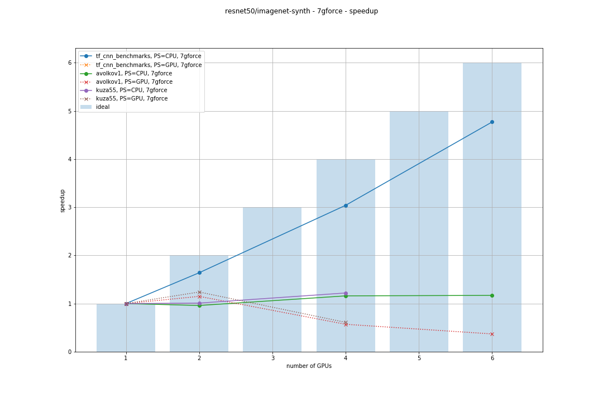
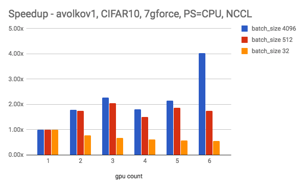
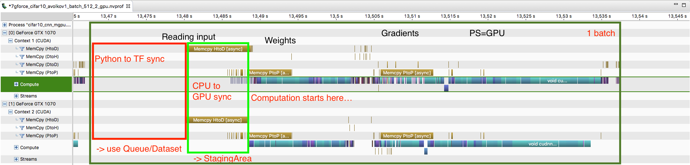

# Towards efficient multi-GPU training in Keras over TensorFlow

_A summary blog post for publishing on Medium and additional resources on GitHub (Markdown documents)._

Bohumír Zámečník, [Rossum AI](https://rossum.ai/), 2017-10-19

## TL;DR

Multi-GPU data-parallel training in Keras over TensorFlow is already possible, but not too efficient. There exist new packages that claim better efficiency at the cost of a bit more complicated API or installation. We provide a survey of the problem and existing solutions and suggest what to do to make it more effcient without using external libraries.

## Introduction

In this blog article there's just a quick summary and more details and code are provided in our [GitHub repository](https://github.com/rossumai/keras-multi-gpu/tree/master/blog/docs).

### Why?

In [Rossum](https://rossum.ai) we'd like to reduce training of our image-processing models from around a day to several hours. We use [Keras](https://keras.io) over [TensorFlow](https://www.tensorflow.org). At hand we have a custom-built machine with 7 GPUs (GTX 1070 and 1080) and common cloud instances with 2-4 GPUs (eg. Tesla M60). Can we utilize them to speed up the training?

It's not uncommon that bigger models take many hours to train. We already parallelize the computation by using many-core GPUs. Next step is using multiple GPUs, then possibly multiple machines. Although we introduce more complexity, we expect decrease in training time. Ideally the training should scale inversely and the throughput of data samples per second linearly with respect to the number of GPUs. Of course we also expect some overhead of operations that cannot be parallelized.

[TenslowFlow shows](https://www.tensorflow.org/performance/benchmarks) achieving almost linear speed-up in their benchmarks of high-performance implementations of non-trivial models on cloud up to 8 GPUs.

Can we do similarly in our models using Keras over TensorFlow? So far we have a lot of models written in Keras running over TensorFlow and we chose these technologies for long term. Although rewriting to pure TensorFlow might be possible, we'd lose a lot of comfort of high-level API of Keras and it's benefits like callbacks, sensible defaults, etc.

### Scope

We limit the scope of this effort to training on single machine with multiple commonly available GPUs (such as GTX 1070, Tesla M60), not distributed to multiple nodes, using data parallelism and we want the resulting implementation in Keras over TensorFlow.

### Organization of the article

Since the whole topic is a bit complex the main story is outlined in this article and details have been extracted into several separate articles. First we review existing algorithms a techniques, then existing implementations of multi-GPU training in common deep learning frameworks. We need to consider hardware since the performance heavily depends on it. To get intuition on what techniques are working well and how we perform and evaluate various measurements of existing implementations. For that we figure out what architectures and datasets are suitable for benchmarking. Then we finally review and measure existing approaches of multi-GPU training specifically in Keras + TensorFlow and indicate their problems. Finally we suggest which techniques might help.

In addition there's:

- [code repository](https://github.com/rossumai/keras-multi-gpu)
- [big spreadsheet with measurements ](https://docs.google.com/spreadsheets/d/1c5yGydEANMzHjBufTzph0w-WGwJyiwPMRYz3yBZatb4/edit#gid=0)

### Let's dive in

- [Algorithms and techniques](algorithms-and-techniques.md)
- [Hardware](hardware.md)
- [Other implementations](other-implementations.md)
- [Implementations in Keras over TensorFlow](keras-tensorflow.md)
- [Measurements](measurements.md)
- [Conclusion and suggestions how to improve](conclusion.md)

### Short conclusion

Currently multi-gpu training is already possible in Keras. Besides various third-party scripts for making a data-parallel model there's already [a implementations in the main repo](https://github.com/fchollet/keras/blob/3dd3e8331677e68e7dec6ed4a1cbf16b7ef19f7f/keras/utils/training_utils.py#L56-L75) (to be released in 2.0.9). From our experiments we see it's runnable and it's able to provide some speed-up but not as high as possible (eg. compared to TensorFlow benchmarks).

Also there are some recently released third-party packages like [horovod](https://github.com/uber/horovod) or [tensorpack](https://github.com/tensorpack) that support data-parallel training with TensorFlow and Keras. Both claim good speed-up (so far we weren't able to measure them) and the cost of a little bit more complicated API or installation.

From measuring TensorFlow benchmarks ([tf_cnn_benchmarks](https://github.com/tensorflow/benchmarks/tree/master/scripts/tf_cnn_benchmarks)) we can see that good speed-up with plain TensorFlow is possible but rather complicated. They key ingredients seem to be asynchronous data feeding to from CPU to GPU using StagingArea and to TF memory (either from Python memory using TF queues or from disk).

Ideally we'd like good speed-up with simple Keras-style API and without relying on external libraries other than Keras and TensorFlow themselves. In particular we need to correcly implement pipelining (at least double-buffering) of batches at GPU using StagingArea and if necessary also providing data to TF memory asynchronously (using TF queues or Dataset API). It should be verified with nvprof.

Along with this article [we provided some code](https://github.com/rossumai/keras-multi-gpu) to help with making benchmarks of multi-GPU training with Keras.
