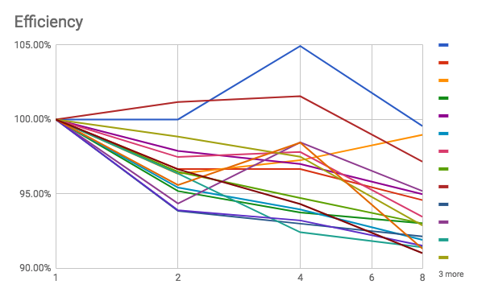
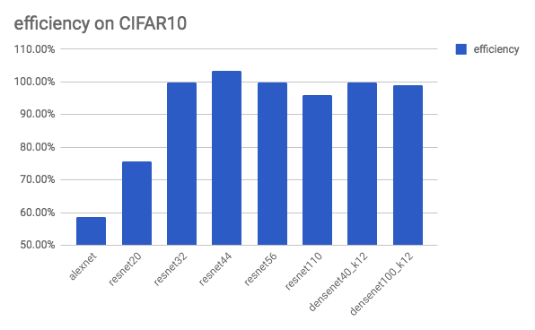
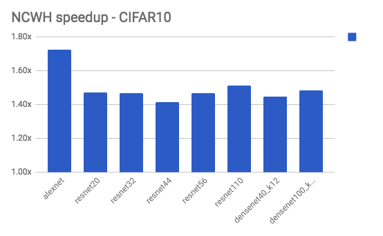
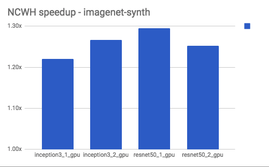

# Experiments and measurements

Let's try various approaches in practice, measure their performance and decide what techniques are suitable.

## Introduction

### Metrics

- What to measure?
    - **images/sec** (thoughput)
        - or in general data points / sec
        - used in TF benchmarks
        - independent of dataset size, batch size, etc.
        - either mean or median over batches within epoch or overall
        - we wrote a callback [SamplesPerSec](https://github.com/rossumai/keras-multi-gpu/blob/c873bbae922876121d719a4ffb4a8d8d4802d68f/keras_tf_multigpu/callbacks.py#L51) for measuring that
    - <del>Keras epoch time (sec)</del>
        - it's tempting to reuse this output
        - too coarse-grained (integer)
        - not comparable with TF benchmarks
        - dependent on dataset size, might comprise time for callbacks, validation, etc.
    - wall time
        - might be useful to quantify the overhead like model compilation, etc.
- **[speedup](https://en.wikipedia.org/wiki/Speedup)** in throughput
    - thoughput on N GPUs / througput on 1 GPU
- **[efficiency](https://en.wikipedia.org/wiki/Analysis_of_parallel_algorithms)** - speedup per GPU (in %)
    - speedup normalized by number of GPUs, more comparable
    - we want ideally 100% efficiency

In general with data-parallel training we expect to run the same batch size on multiple GPUs in parallel. In this case the time for a batch should be the same (except for some overhead), but total epoch time should be reduced. Anyway, that's the goal of our effort - to reduce the total training time.

### Warm-up

We observed that training is slow at the beginning and then after some warm-up period it stabilizes at much faster speed. So we can ignore data from the warm-up period, typically one to 4 epochs.

One cause might be TensorFlow dynamically optimizing the graph. Another cause is concurrectly running other processing utilizing the GPU, that are automatically killed after up to 1 minute of seeing an ML process.

It would be good to quantify the warm-up period in time or number of epochs/batches. So far we just take measurements after roughly 5-10 epochs or compute median value. In `tf_cnn_benchmarks` the models are also warmed-up.

### Our code repository

[github.com/rossumai/keras-multi-gpu](https://github.com/rossumai/keras-multi-gpu)

- packaged kuza55 and avolkov1 make_parallel() functions
- examples using InceptionV3 and Resnet50
- code for synthesizing a dataset of shape of CIFAR10 or ImageNet
- SamplesPerSec callback for measuring throughput in batches
- code for easy benchmarking kuza55, avolkov1 and fchollet multi-gpu models
- experimental code with avolkov1 multi-gpu and TF queues with CIFAR10 CNN and InceptionV3/ImageNet
- run scripts and measurement results for both tf_cnn_benchmarks and Keras benchmarks
- code for measuring GPU bandwidth with results
- the blog article content
- some preliminary experiments with [using of StagingArea API with Keras](https://gist.github.com/bzamecnik/f763d6b6d25dce571ddd6dcc3129daf3)

### Results

Our experiments and their results are stored in a big [spreadsheet](https://docs.google.com/spreadsheets/d/1c5yGydEANMzHjBufTzph0w-WGwJyiwPMRYz3yBZatb4/edit#gid=1598430941). In this article there is only a summary.

## TensorFlow Benchmarks

### What speedups are possible on non-trivial models?

#### TensorFlow benchmarks - their measurements

Let's first have a look at existing benchmark results to get an idea of what's possible with carefully tuned models before running our experiments.

TensorFlow benchmarks provide [their measurements](https://www.tensorflow.org/performance/benchmarks) where they show good scaling achievable in TensorFlow. They run InceptionV3, Resnet50 and a few other models on real ImageNet synthetic ImageNet dataset using either multi-GPU or distributed setup and differt kind of GPUs/machines (P100 on DGX-1, K80 on Google Cloud Engine and K80 on EC2).

In order to make the measurement more comprehensible and comparable we summarized their results in one table and computed speedup and efficiency from the raw images/sec metric. See our [spreadsheet](https://docs.google.com/spreadsheets/d/1c5yGydEANMzHjBufTzph0w-WGwJyiwPMRYz3yBZatb4/edit#gid=1598430941) for details.

GPUs|median speedup|median efficiency
----|--------------|-----------------
2|1.93x|96.42%
4|3.87x|96.84%
8|7.44x|93.02%

##### Observations

- **scaling is really good**
- with more GPUs efficiency goes down a little bit (but still over 90%)
- sometimes there's superlinear speedup - probably due to noise in the 1-GPU measurement
- **using real or synth dataset doesn't show any significant effect**, thus we can use synthetic dataset to estimate performance on real dataset
- using batch size 64 or 32 doesn't show any significant effect
- this kind of training is 4.4x faster (median) on P100 than K80
- training resnet50 is 1.61x faster (median) than inception3 in this benchmark
- both architectures on this dataset have roughly 24-26 million parameters
- baseline performance on 1x Tesla K80 is 30 images/sec on InceptionV3 and 50 images/sec on Resnet50

What can we take for our experiments in order to replicate conditions for scaling?

- we can train on non-trivials convolutional models like **InceptionV3** or **Resnet50** with tens of millions parameters
- **synthetic imagenet** dataset like imagenet is OK even if it's synthetic (just random numbers of the same shape)
- **batch size 32** is OK (if it fits in GPU memory)

### Executing the `tf_cnn_benchmarks` scripts

See [High-Performance Models -  Executing the script](https://www.tensorflow.org/performance/performance_models#executing_the_script).

Also we provide [scripts for running our experiments](https://github.com/rossumai/keras-multi-gpu/tree/master/experiments/tensorflow/tf_cnn_benchmarks).

### What kind of variable update to use?

Possible options are:

- parameter server (PS) - on CPU or one of GPUs
- replicated - with implicit copy or via NCCL

What are recommendations?

[TF benchmarks](https://www.tensorflow.org/performance/benchmarks) use:

- for models like InceptionV3, ResNet50 they use parameter server on CPU
- for models like AlexNet or VGG16 replicated parameters with NCCL

[TF Performace guide - Optimizing for GPU](https://www.tensorflow.org/performance/performance_guide#optimizing_for_gpu) is consistent with that (at least for cards like M60, P100, GTX1070). For K80 it recommends either PS=CPU or PS=GPU (depending on usage of GPUDirect).

Our measurements:

### CIFAR10

Is CIFAR10 usable as a smaller alternative to ImageNet?

Compared to CIFAR10, ImageNet itself is big (hundereds of GB) and not easy to obtain in a ready-made form. Altough we can use synthetic ImageNet, there are still a lot of examples using CIFAR10.

`tf_cnn_benchmarks` contain also set of models on CIFAR10. Let's try what scaling do we get.

Machine: `az-2x-m60` (2xTesla M60), TensorFlow 1.3.0, scaling on 2 GPUs parameters server at CPU.

| model           | number of params | speedup | efficiency |
|-----------------|------------------|---------|------------|
| alexnet         | 1,756,620        | 1.17x   | 58.70%     |
| resnet20        | 271,164          | 1.51x   | 75.65%     |
| resnet32        | 466,492          | 2.00x   | 99.93%     |
| resnet44        | 661,820          | 2.07x   | 103.28%    |
| resnet56        | 857,148          | 2.00x   | 99.83%     |
| resnet110       | 1,736,124        | 1.92x   | 96.04%     |
| densenet40_k12  | 364,772          | 2.00x   | 99.94%     |
| densenet100_k12 | 2,259,652        | 1.98x   | 98.89%     |

Observations:

- on most models (except AlexNet and ResNet20) we see perfect speedup
- ResNet20 got better results with replicated variable + NCCL (1.643x/82.14%)
    - otherwise PS=CPU was the best option
- even smaller models with 500k parameters can be parallelized
- models with less than ~400k parameters may not be suitable for parallelization
- possibly some noise on resnet44 giving superlinear speedup

Important result:

> **Efficient multi-GPU training is possible on CIFAR10 dataset and on small CNN  models.**

### InceptionV3 and ResNet50

https://docs.google.com/spreadsheets/d/1c5yGydEANMzHjBufTzph0w-WGwJyiwPMRYz3yBZatb4/edit#gid=0

On az-2x-m60 we can see perfect scaling to 2 GPUs. On 7gforce we can get up to 4.774x speedup (79% efficiency) with 6 GPUs or 3x speedup at similar efficiency with 4 GPUs. Best results are with PS=CPU. Efficiency with multiple GPUs on 7gforce stays around 75-80 %.

### Which data format NCHW vs. NHWC?

TL;DR: Consistently better to use [NCHW on GPU (due to cuDNN)](https://www.tensorflow.org/performance/performance_guide#data_formats).

On cifar10 and imagenet-synth datasets and various non-trivial models we observed that using NCHW data format gives speedup of +22% to +73%, typically around +25% on bigger imagenet-synth and +50% on smaller cifar10 (rounded median over multiple models). It doesn't have seem to have effect on scaling to multiple GPUs.

### Subtle effects of hardware

We observed interesting effects on our hardware, in particular memory clock and communication of GPUs across PCIe switch (PIX) or across the CPU (PHB).

Both were observed in `tf_cnn_benchmarks` with AlexNet model over imagenet-synth dataset at our `7gforce` machine.

### Memory clock effects

Given 6x GTX 1070:

| GPU | total images/sec | % | memoryClockRate (GHz) | % |
|-----|------------------|---|-----------------------|---|
| 0 | 1561.745 | 100.00% | 1.7715 | 100.00% |
| 1 | 1321.96 | 84.65% | 1.6830 | 95.00% |
| 2 | 1543.53 | 98.83% | 1.6830 | 95.00% |
| 3 | 1476.505 | 94.54% | 1.6830 | 95.00% |
| 4 | 1567.65 | 100.38% | 1.7715 | 100.00% |
| 5 | 1567.77 | 100.39% | 1.7715 | 100.00% |

Throughput of GPUs (relative to GPU 0) differs. We could see two groups: one at 100% speed (0,4,5), one at 85-98% speed (1,2,3). This looked strange. By inspecting the GPU detail, we found that the GPUs are set to two different memory clock values: 1.7715 and 1.6830 GHz.

It's possible that memory clock may be set dynamically or manually. For details you can check eg. [nvidia-smi: Control Your GPUs](https://www.microway.com/hpc-tech-tips/nvidia-smi_control-your-gpus/). We just wanted to note that even such settings may have effect on the training speed.

### PIX vs. PHB

Our GPU topology is [a little bit complicated](hardware.md#topology) and `nvidia-smi` shows us two groups, each interconnected via single PIX and connected across via PHB. Is there any significant effect of crossing the PHB and should we try to keep training within one PIX group, or we can just select any bunch of GPUs?

We tried to run AlexNet in a few configurations on a pair of GPUs within a PIX group and across: [0,1] (one group), [4,5] (other group), [0,5] (across).

| PS | variable_update | NCCL | PIX | PIX | PHB | speedup PIX vs. PHB |
|--------------|------------------|-------|---------|---------|---------|----------|
| | | | 0,1 | 4,5 | 0,5 | |
| gpu | parameter_server | FALSE | 1863.78 | 1830.2 | 1572.61 | 1.17x |
| cpu | parameter_server | FALSE | 1240.73 | 1233.27 | 1225.74 | 1.01x |
| gpu | replicated | FALSE | 1196.69 | | 1210.87 | 0.99x |
| gpu | replicated | TRUE | 1428.81 | | 1175.59 | 1.22x |
| gpu | independent | FALSE | 2751.71 | | 2643.55 | 1.04x |

Observations:

- for CPU as parameter server or replication with implicit it doesn't matter
- for GPU as parameter server or replication with NCCL it hurt a bit (20% faster PIX than PHB)

Since we use CPU as PS anyway, it seems we don't have to worry too much.

## Keras + TensorFlow

### First @kuza55 example

One of the first first running examples of multi-GPUs appeared in article [Transparent Multi-GPU Training on TensorFlow with Keras](https://medium.com/@kuza55/transparent-multi-gpu-training-on-tensorflow-with-keras-8b0016fd9012) by @kuza55. It showed an example with a bigger MLP model (21M params) on a synthetic dataset.

We [tried to run it](https://github.com/rossumai/keras-multi-gpu/tree/master/experiments/keras_tensorflow/kuza55/original_examples) on az-2x-m60 and 7gforce (both on 2 GPUs). The results are very poor. Measured was epoch time.

machine|parameter server|speedup
-------|----------------|-------
az-2x-m60|CPU|1.2x
az-2x-m60|GPU|1.29x
7gforce|CPU|0.43x
7gforce|GPU|0.65x

Better would be nice to try it some more realistic model. See more measurements on InceptionV3 and Resnet50.

### @avolkov on CIFAR10

@avolkov provided an example of training a CIFAR10 model similar to one in Keras examples (a smaller convnet with 1.25M parameters).

- [experiment script](https://github.com/rossumai/keras-multi-gpu/blob/master/keras_tf_multigpu/examples/avolkov1/cifar/cifar10_cnn_mgpu.py)
- [runs and results](https://github.com/rossumai/keras-multi-gpu/tree/master/experiments/keras_tensorflow/avolkov1/cifar10)

Originally there were measurement on too small batch sizes which gave bad scaling. When using much bigger batch sizes, it scaled much better, eg. 4x on 6 GPUs. In practice such large batch sizes could be possible used with high learning rate and warmup.

| Speedup   | batch_size | batch_size | batch_size |
|-----------|------------|------------|------------|
| gpu count | 4096       | 512        | 32         |
| 1         | 1.00x      | 1.00x      | 1.00x      |
| 2         | 1.80x      | 1.75x      | 0.78x      |
| 3         | 2.28x      | 2.04x      | 0.67x      |
| 4         | 1.80x      | 1.49x      | 0.61x      |
| 5         | 2.16x      | 1.87x      | 0.58x      |
| 6         | 4.03x      | 1.76x      | 0.55x      |

| Efficiency | batch_size | batch_size | batch_size |
|------------|------------|------------|------------|
| gpu count  | 4096       | 512        | 32         |
| 1          | 100.00%    | 100.00%    | 100.00%    |
| 2          | 91.15%     | 87.69%     | 39.09%     |
| 3          | 76.05%     | 68.04%     | 22.38%     |
| 4          | 45.04%     | 37.37%     | 15.33%     |
| 5          | 43.17%     | 37.43%     | 11.64%     |
| 6          | 67.16%     | 29.26%     | 9.19%      |

On 7gforce using GPUs we can get to 4x speedup at 67.16% efficiency. That's really not bad. But we have to use an extremely big batch size. For smaller batch sizes the scaling is very poor or harmful.

In contrast tf_cnn_benchmarks achieve almost perfect scaling even on batch size 128. On 7gforce we observed speed up 1.841x on 2 GPUs and 3.510x on 6 GPUs.

### @avolkov1 and @kuza55 on InceptionV3/Resnet50 and synthetic ImageNet

In order to compare with `tf_cnn_benchmarks` on more realistic models/datasets, let's adapt @avolkov1 and @kuza55 code to InceptionV3/Resnet50 models on  synthetic ImageNet dataset.

We incorporated and adapted the code their code into [our benchmark repository](https://github.com/rossumai/keras-multi-gpu/tree/master/keras_tf_multigpu), so that it can be easily used via imports, parameterized and measured. We reused the existing InceptionV3/Resnet50 model definitions from `keras.applications` and made [code to synthesize random dataset](https://github.com/rossumai/keras-multi-gpu/blob/master/keras_tf_multigpu/examples/datasets.py) in the shape of ImageNet. The resulting benchmark script is [benchmark_inception3_resnet50.py](https://github.com/rossumai/keras-multi-gpu/blob/master/keras_tf_multigpu/examples/benchmark_inception3_resnet50.py). For both we use batch size 32, as more doesn't fit within 8 GB of GPU memory. No NCCL.

InceptionV3 with images of size 299^2:

| machine   | GPUs   | PS      | images/sec | speedup | efficiency | images/sec | speedup | efficiency |images/sec | speedup | efficiency |
|-----------|--------|---------|------------|----------|---------|------------|-------------------|---------|------------|-------|---------|
|||| kuza55 | kuza55 | kuza55 | avolkov1 | avolkov1  | avolkov1 | tf_cnn_benchmarks | tf_cnn_benchmarks | tf_cnn_benchmarks |
| az-2x-m60 | 1      | GPU     | 31.71      | 1.00x    | 100.00% | 31.67      | 1.00x             | 100.00% | 47.49      | 1.00x | 100.00% |
| az-2x-m60 | 2      | CPU     | 53.35      | 1.68x    | 84.12%  | 54.58      | 1.72x             | 86.17%  | 95.43      | 2.01x | 100.47% |
| az-2x-m60 | 2      | GPU     | 53.33      | 1.68x    | 84.09%  | 53.20      | 1.68x             | 83.99%  | 94.72      | 1.99x | 99.73%  |
| 7gforce   | 1      | GPU     | 39.07      | 1.00x    | 100.00% | 41         | 1.00x             | 100.00% | 78.44      | 1.00x | 100.00% |
| 7gforce   | 2      | CPU     | 49.01      | 1.25x    | 62.72%  | 50.1       | 1.22x             | 61.10%  | 118.32     | 1.51x | 75.42%  |
| 7gforce   | 4      | CPU     | 60.38      | 1.55x    | 38.64%  | 64.05      | 1.56x             | 39.05%  | 236.86     | 3.02x | 75.49%  |
| 7gforce   | 6      | CPU     | error      | N/A  | N/A | 65.37      | 1.59x             | 26.57%  | 351.98     | 4.49x | 74.79%  |
| 7gforce   | 2      | GPU     | 57.15      | 1.46x    | 73.14%  | 55.57      | 1.36x             | 67.77%  | 126.68     | 1.61x | 80.75%  |
| 7gforce   | 4      | GPU     | 33.00      | 0.84x    | 21.12%  | 32.23      | 0.79x             | 19.65%  | 180.92     | 2.31x | 57.66%  |
| 7gforce   | 6      | GPU     | error      | N/A  | N/A | 21.33      | 0.52x             | 8.67%   | N/A        |  N/A | N/A   |

Resnet50 with images of size 224^2:

| machine   | GPUs   | PS      | images/sec | speedup | efficiency | images/sec | speedup | efficiency |
|-----------|--------|---------|------------|----------|---------|------------|-------------------|---------|
|||| kuza55 | kuza55 | kuza55 | avolkov1 | avolkov1  | avolkov1 |
| az-2x-m60 | 1      | GPU     | 41.69      | 1.00x    | 100.00% | 41.64      | 1.00x | 100.00% |
| az-2x-m60 | 2      | CPU     | 71.72      | 1.72x    | 86.02%  | 71.73      | 1.72x | 86.13%  |
| az-2x-m60 | 2      | GPU     | 67.18      | 1.61x    | 80.57%  | 68.78      | 1.65x | 82.59%  |
| 7gforce   | 1      | GPU     | 54.52      | 1.00x    | 100.00% | 58.19      | 1.00x | 100.00% |
| 7gforce   | 2      | CPU     | 55.09      | 1.01x    | 50.52%  | 56.02      | 0.96x | 48.14%  |
| 7gforce   | 4      | CPU     | 66.55      | 1.22x    | 30.52%  | 67.33      | 1.16x | 28.93%  |
| 7gforce   | 6      | CPU     | error      | N/A  | N/A | 68.21      | 1.17x | 19.54%  |
| 7gforce   | 2      | GPU     | 67.34      | 1.24x    | 61.76%  | 66.9       | 1.15x | 57.48%  |
| 7gforce   | 4      | GPU     | 33.29      | 0.61x    | 15.27%  | 33.43      | 0.57x | 14.36%  |
| 7gforce   | 6      | GPU     | error      | N/A  | N/A | 21.56      | 0.37x | 6.18%   |

Observations:

- on az-2x-m60 the efficiency is around 85%
    - quite good, but still far from perfect (tf_cnn_benchmarks) efficiency
- on 7gforce the efficiency is lower and goes down with more GPUs quickly
    - this is not usable in practice
    - in comparison, with tf_cnn_benchmarks efficiency stays at around 75 %
- kuza55 fails on non-power-of-two number of GPUs
- avolkov1 gave offen a little bit less speedup compared to kuza55
- all in all both method give almost the same results, except that avolkov1 code is more developed
- where is better to put PS? 2 GPUs: GPU, more than 2 GPUs: CPU

Conclusions:

While it's possible to get some significant speedup on a cloud machine with good GPU PCIe bandwidth, on a custom machine with low PCIe bandwidth this usage of code is not efficient.

Question:

- Why this kind of model/dataset combination failed on 7gforce?
    - Because of bigger samples or more model parameters?

`tf_cnn_benchmarks` differ from our Keras experiments by using StagingArea and TF queue to prefect input data. Still they have to exchange weights and gradients. Altough tf_cnn_benchmarks allow staged weights (essentially pipelining also in these data transfers at the cost of going away from the pure SGD algorithm), we didn't use that. So it makes sense to try to focus on data feeding.

#### Comparing 1-GPU speed with tf_cnn_benchmarks

| model      | machine   | gpu       | tf_cnn_benchmarks NCHW | tf_cnn_benchmarks NHWC | % of NCHW | kuza55 NHWC | % of NCHW | % of NHWC | avolkov1 NHWC | % of NCHW | % of NHWC |
|------------|-----------|-----------|------------------------|------------------------|-----------|-------------|-----------|-----------|---------------|-----------|-----------|
| inception3 | az-2x-m60 | Tesla M60 | 47.49                  | 38.92                  | 81.95%    | 31.71       | 66.77%    | 81.47%    | 31.67         | 66.69%    | 81.37%    |
| inception3 | 7gforce   | GTX 1070  | 78.44                  | 68.72                  | 87.61%    | 39.07       | 49.81%    | 56.85%    | 41            | 52.27%    | 59.66%    |
| resnet50   | az-2x-m60 | Tesla M60 | 77.94                  | 60.21                  | 77.25%    | 41.69       | 53.49%    | 69.24%    | 41.64         | 53.43%    | 69.16%    |

Keras multi-GPU models are at 50-67% speed of optimized tf_cnn_benchmarks models and at 50-80% of tf_cnn_benchmarks using the same NHWC data format.

It means that there's a big opportunity to get most speedup on the 1-GPU training by using NCHW data format, the rest probably by optimizing data transfers.

#### Speedup of 1 GTX 1070 vs. Tesla M60

| model      | method            | data format | speedup |
|------------|-------------------|-------------|---------|
| inception3 | tf_cnn_benchmarks | NCHW        | 1.65x   |
| inception3 | kuza55            | NHWC        | 1.23x   |
| inception3 | avolkov1          | NHWC        | 1.29x   |
| resnet50   | kuza55            | NHWC        | 1.31x   |
| resnet50   | avolkov1          | NHWC        | 1.40x   |

GTX 1070 has 93.75% of cores and 160% of internal memory bandwidth compared to Tesla M60 ([sheet](https://docs.google.com/spreadsheets/d/1pQNWTLfsBmclB3lojc5DHPZCRoKATjNqDA1Sbwq4zeE/edit#gid=0)). It seems that `tf_cnn_benchmarks` are able to utilize this bandwidth. Existing Keras multi-GPU packages still achive some speedup at this card, but smaller.

### @fcholet's new multi_gpu_model

From the code inspection and first measurement it seems the performance is the same as for @kuza55 and @avolkov1. We need to make exact measurements.
